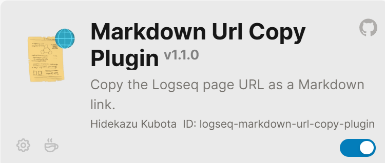

- Following are two methods of using [[Affine]] diagram label to a [[Logseq]] block.
	- Method 1
		- {:height 104, :width 198}
		-
		- is a plugin for logseq where the format `[dspn](logseqlink)` is generated and pasted into affine. Then copy from affine and paste onto logseq as a link to go to the block.
			- So your workflow becomes:
				- Right-click a block in Logseq → "Copy block URL as Markdown link"
				- Paste directly into AFFiNE — done
	- Method 2:
		- Copy URL link 1ogseq//` and then paste it to Affine. To open the logseq block associated with the link, 1. Copy the link, 2. open logseq, 3. Press Windows + R, 4.Paste the link in the box and press enter which will open the associated logseq page.
			-
-
-
-
-