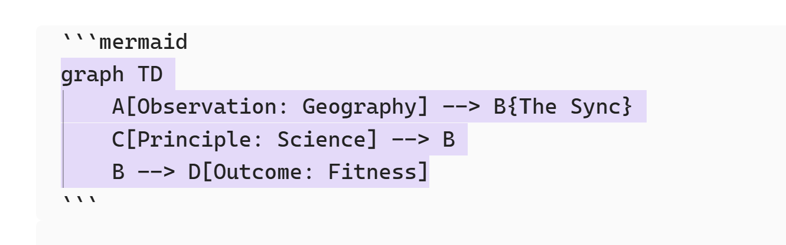

- Variety in Fibres and Polyphenols could provide the biggest variety of "tools" that the gut bacteria can metabolise and improve in health outcomes for [[dietary science]] and [[nutrition]]. The ZOE scientists spoke about 30 different varieties.  Ground breaking research that reveals the 50 different gut bacteria you need to reshape body fat" in #YouTube. it seems that "variety is the spice of life".
- In order to generate [[Mermaid ]] code in [[Obsidian]], I use the format below. Note the starting and ending line which the code must be between. In logseq, I have to use the backslash and [[Mermaid]] and then the code block is generated where I can write the Mermaid code.
- {:height 251, :width 778}
- {{renderer :mermaid_69df5e97-86b5-4893-bb00-8dcbd07b2c6e, 3}
  collapsed:: true
	- ```mermaid
	  graph TD
	      A[Observation: Geography] --> B{The Sync}
	      C[Principle: Science] --> A
	      B --> D[Outcome: Fitness]
	  ```