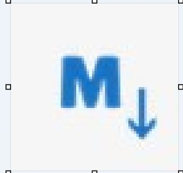

### The "Copy to Markdown" Bridge

If you just want the text for your **Logseq/Obsidian** :
- collapsed:: true
  
  Install an extension like **"MarkDownload"** or **"Copy as Markdown."**
	- 
- Click the extension while on the page.
- It will show you a preview of the text it can "see."
- If the text is there, click **Download**.
- **The Benefit:** You can drag this Markdown file directly into your Logseq `pages` folder. It bypasses Readwise entirely, ensuring you have the full details immediately.
-
-